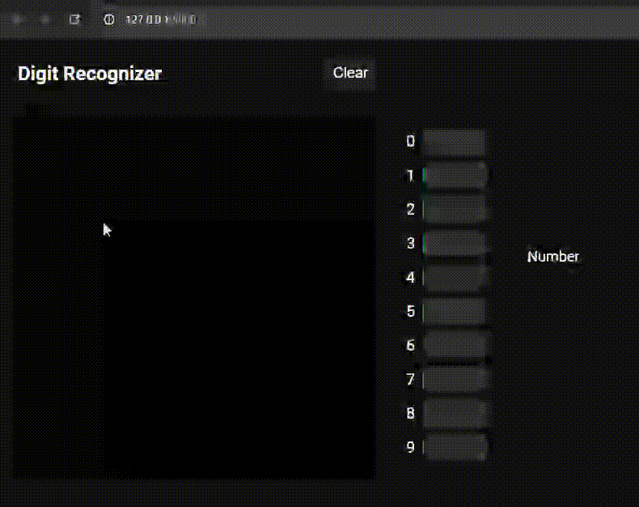

# Machine Learning project

Library for training and using neural networks

## Example usages (`examples` folder)
1. `digits` - Handwritten digit recognizer
    
2. `xor` - Neural network that predicts logic XOR operator